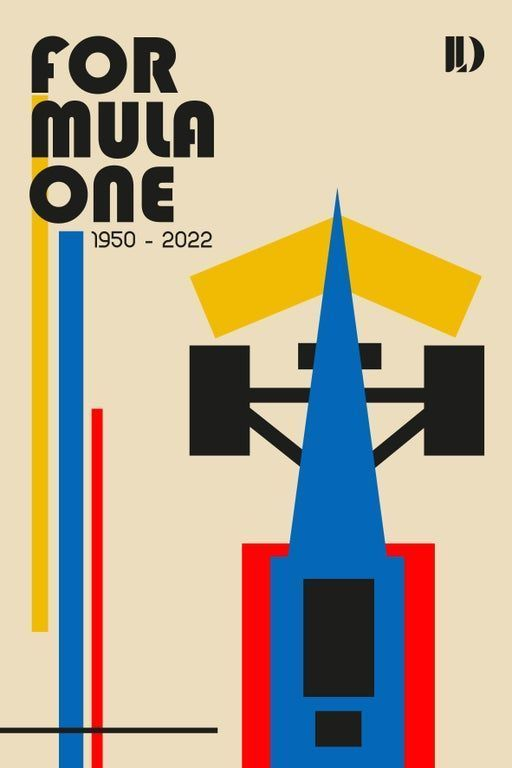
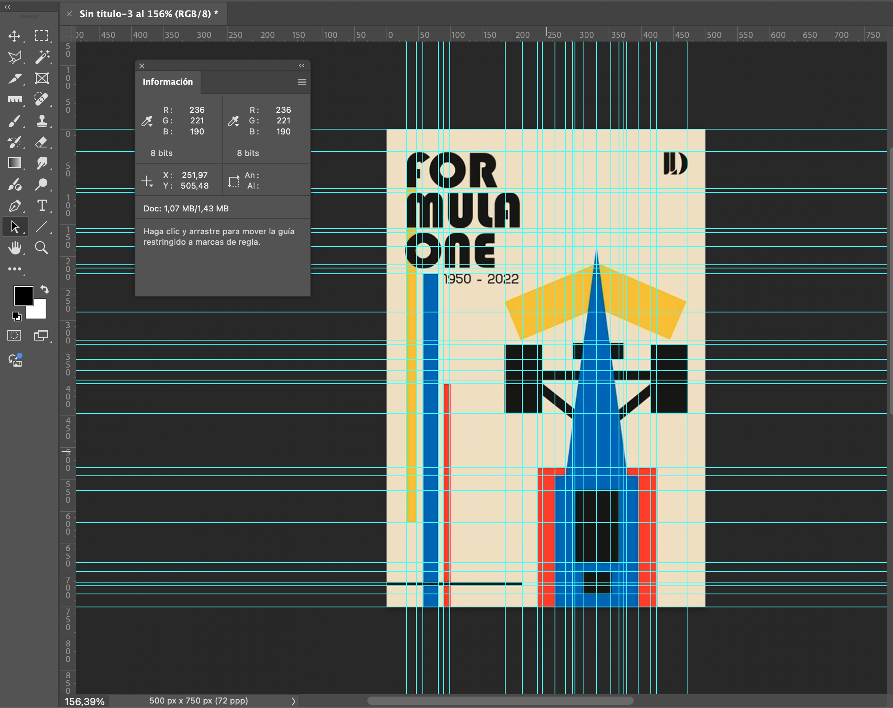
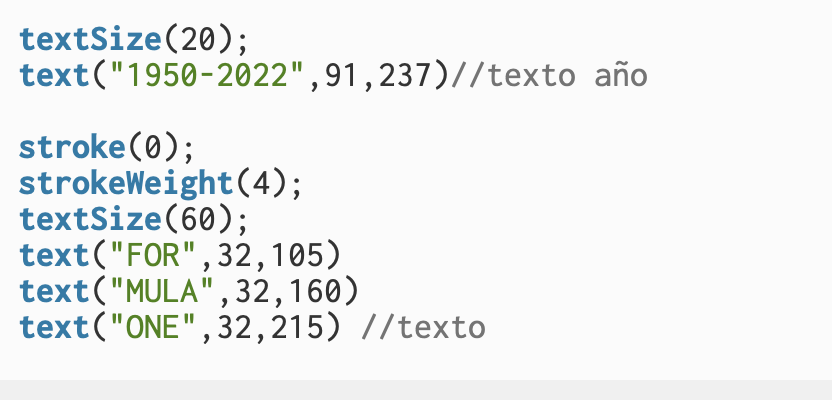

# pensamiento computacion solemne 1 
## repositorio proceso de solemne 1 
este repositorio muestra mi proceso para la solemne 1 de el ramo 

## eleccion de obra 
buscando dentro de muchos artistas no me llamaba la atencion ni una de sus obras asi que busque por pinterest y dentro de sugerencias por cosas que ya habia visto antes me muestra un poster de la Formula 1 de la Bauhaus, me llamo mucho la atencion porque la formula 1 es uno de mis intereses personales asi que escogi ese, tuve problemas por que el poster tiene letras ya uqneu nos habain enseñado a poner un texto no estaba segura de como hacerlo y si se podia pero decidi hacerlo de todas formas porque era lo unico que me habia gustado. 
otra razon por la que lo elegi es porque cumplia con los requisitos para seleccionarlo, tenia formas basicas que se podian lograr con lo aprendido en clase y distintos colores y formas que sobrepasaban otras cosa que tambien era bueno porque asi podia mostrar que si comprendi el sistema de orden, las formas mas marcadas y usadas son los rectangulos y use triangulos igual, lamentablemente no usaba circulos pero no crei que eso fuera un problema asi que segui adelante.

para poder sacar las coordenadas use photoshop, puse la imagen en el tamaño de los mismos pixeles tanto en photoshop como en p5.js, de ahi use reglas para marcar todos los puntos y luego con regla, el cursor y la ventana de informacion fui sacando las coordenadas, en photoshop y los colores.
 
dentro de las dificultades fueron las lineas rectas pero que estaban en diagonales, no estaba segura como hacerlas pero una solucion que encontre fue dividar la figura en dos triangulos para poder lograrla cosa que me funciono super bien, otro problema fue que no sabia como hacer el tema de la tipografia porque recordaba que en clase se nos menciono de forma general el como poner texto, pero no recordaba que nos dijeran si se podia cambiar el tamaño, preferi investigar porque la otra opcion era dejarlo sin le texot pero no queria hacer eso, aunque cambiaria la tipografia preferia poner el texto o esa parte quedaria muy vacia y cambiaria la composicion, al investigar dentro de google vi que se podia agrandar el texto y use eso que decia en google para poder agrandar el texto cosa que me funciono muy bien 

aqui se muestra el como hice el codigo, posicione el texto como nos enseñaron en la clase y luego use el codigo a ver si funcionaba y ahi fui ajustando que tanto lo queria agrandar y luego agrande el stroke para que se viera lo mas parecido al poster original, aunque se viera distinta la tipografia me gusto el como se pudo resolver.
ya otras dificultades fueron menores mas que nada porque se me olvidaba separar bien y poner (;) entonces los codigos funcionaban distinto pero dandome una vuelta por la pagina de p5.js pude recordar y seguir. 
ya esta es mi replica:
![image]

